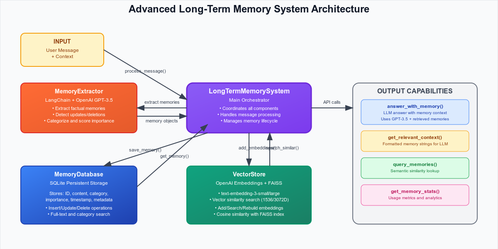

# 🧠 Advanced Long-Term Memory System for LLM Agents

A sophisticated memory storage and retrieval system that provides LLMs with persistent, searchable long-term memory capabilities. This system can extract, store, update, and retrieve memories from conversations, enabling AI agents to maintain context across multiple sessions.

## ✨ Features

- **Intelligent Memory Extraction**: Automatically extracts factual information from conversations using OpenAI GPT
- **Semantic Search**: Vector-based similarity search using OpenAI embeddings and FAISS
- **Memory Management**: Add, update, and delete memories with conflict resolution
- **Persistent Storage**: SQLite database for reliable memory persistence
- **Category Organization**: Automatic categorization of memories (tools, preferences, personal, habits, etc.)
- **Importance Scoring**: Weighted importance system for memory prioritization
- **Real-time Updates**: Detect and process memory updates and deletions from natural language
- **Web Interface**: Comprehensive Streamlit-based testing and management interface
- **LangChain Integration**: Built with LangChain for robust LLM interactions
- **Modular Architecture**: Clean separation of concerns with well-defined components

## 🏗️ Architecture

The system follows a layered architecture with clear separation of concerns:



### Core Components

1. **LongTermMemorySystem** - Main orchestrator that coordinates all components
2. **MemoryExtractor** - Uses OpenAI GPT via LangChain to extract and categorize memories
3. **VectorStore** - Handles embedding generation and semantic search using OpenAI embeddings and FAISS
4. **MemoryDatabase** - SQLite-based persistent storage with CRUD operations

### Data Flow Pipeline

1. **Input Processing**: Analyze user messages and detect memory updates
2. **Memory Processing**: Extract, categorize, and score memories for importance
3. **Storage**: Persist memories in SQLite and index vectors in FAISS
4. **Retrieval**: Semantic search and similarity matching for relevant memories
5. **Response Generation**: Context-aware, memory-enhanced responses

### External Dependencies

- **OpenAI API**: GPT-3.5 Turbo for memory extraction and text embeddings
- **LangChain**: Framework for LLM interactions and prompt management
- **FAISS**: Facebook AI Similarity Search for vector indexing
- **SQLite**: Lightweight, serverless database for persistent storage

## 📁 Project Structure

```
long-term-memory/
├── 📄 memory_system.py          # Core memory system implementation
├── 🌐 app.py                    # Streamlit web interface
├── 📋 requirements.txt          # Python dependencies
├── 📖 README.md                 # Project documentation
├── 🗄️ memory.db                 # SQLite database (auto-created)
├── 🔧 .env                      # Environment variables (OpenAI API key)
├── 📁 media/                    # Documentation assets
│   └── system_architecture.svg  # System architecture diagram
├── 📁 Extra/                    # Additional resources
│   └── my_task.txt             # Project requirements and tasks
└── 📁 .venv/                   # Python virtual environment
```

### Core Files Description

#### `memory_system.py` (18,119 bytes)
The main implementation containing all core classes:

- **Memory**: Data class representing a memory entry with fields for content, category, importance, timestamp, embedding, and metadata
- **ExtractedMemory**: Pydantic model for structured memory extraction
- **MemoryUpdate**: Pydantic model for memory update operations
- **MemoryExtractor**: Handles memory extraction and update detection using GPT-3.5 Turbo
- **VectorStore**: Manages vector embeddings and similarity search with FAISS
- **MemoryDatabase**: SQLite database operations for persistent storage
- **LongTermMemorySystem**: Main orchestrator class providing the public API

#### `app.py` (31,620 bytes)
Comprehensive Streamlit web interface featuring:

- **Chat & Memory**: Interactive conversation with real-time memory extraction
- **Query Memories**: Search interface with semantic similarity
- **Memory Analytics**: Visualizations and statistics dashboard
- **Memory Management**: CRUD operations for stored memories
- **System Configuration**: Settings and API key management

#### `requirements.txt`
Essential Python dependencies:
```
langchain
langchain-openai
faiss-cpu
numpy
streamlit
pandas
plotly
pydantic
```

## 📋 Requirements

- Python 3.8+
- OpenAI API key
- Required packages (see requirements.txt)

## 🚀 Installation

1. Clone or download the project files
2. Install dependencies:
   ```bash
   pip install -r requirements.txt
   ```

## 💡 Usage

### Basic Usage

```python
from memory_system import LongTermMemorySystem
import os
from dotenv import load_dotenv

load_dotenv()
memory_system = LongTermMemorySystem(os.getenv("OPENAI_API_KEY"))

# Process a message and extract memories
result = memory_system.process_message(
    "I use Shram and Magnet as productivity tools", 
    user_id="user123"
)

# Query memories
answer = memory_system.answer_with_memory(
    "What productivity tools do I use?"
)
print(answer)  # Output: "You use Shram and Magnet"
```

### Memory Operations

```python
# Extract memories from conversation
result = memory_system.process_message(
    "I don't use Magnet anymore, I switched to Notion",
    user_id="user123"
)

# Search for similar memories
memories = memory_system.query_memories("productivity tools", k=5)

# Get all memories
all_memories = memory_system.get_all_memories()

# Delete a specific memory
memory_system.delete_memory(memory_id)

# Get memory statistics
stats = memory_system.get_memory_stats()
```

### Web Interface

Launch the Streamlit interface:

```bash
streamlit run app.py
```

The web interface provides:
- **Chat & Memory**: Interactive conversation with memory extraction
- **Query Memories**: Search and question-answering interface
- **Memory Analytics**: Visualizations and statistics
- **Memory Management**: View, filter, and delete memories

### Customization

You can customize various aspects of the system:

- **Embedding Model**: Change the OpenAI embedding model in `VectorStore` (text-embedding-3-small or text-embedding-3-large)
- **Database Path**: Specify a custom database location
- **Memory Categories**: Modify the category extraction logic in `MemoryExtractor`
- **Importance Scoring**: Adjust the importance calculation algorithm

## 📊 Memory Structure

Each memory contains:

```python
@dataclass
class Memory:
    id: str                    # Unique identifier
    content: str              # The actual memory content
    category: str             # Category (tools, preferences, personal, etc.)
    importance: float         # Importance score (0.0 to 1.0)
    timestamp: str           # Creation/update timestamp
    embedding: List[float]   # Vector embedding for semantic search
    metadata: Dict          # Additional metadata (user_id, source, etc.)
```

## 🎯 Use Cases

1. **Personal AI Assistants**: Remember user preferences, habits, and information
2. **Customer Service Bots**: Maintain customer history and preferences
3. **Educational AI**: Track learning progress and personalized content
4. **Productivity Tools**: Remember user workflows and tool preferences
5. **Healthcare AI**: Maintain patient information and medical history (with proper security)

## 🔍 How It Works

### Memory Extraction Process

1. **Input Processing**: User message is analyzed by GPT
2. **Fact Extraction**: GPT identifies factual statements about the user
3. **Categorization**: Memories are automatically categorized
4. **Importance Scoring**: Each memory receives an importance score
5. **Embedding Generation**: Vector embeddings are created for semantic search
6. **Storage**: Memories are stored in both SQLite database and FAISS index

### Memory Retrieval Process

1. **Query Processing**: User query is converted to vector embedding
2. **Semantic Search**: FAISS finds most similar memories
3. **Context Assembly**: Relevant memories are formatted as context
4. **Answer Generation**: GPT generates response using memory context

### Memory Update Process

1. **Update Detection**: GPT analyzes new messages for memory updates
2. **Conflict Resolution**: System identifies memories to update or delete
3. **Database Updates**: Changes are applied to persistent storage
4. **Index Maintenance**: Vector index is updated accordingly

## 🔒 Security Considerations

- **API Key Security**: Store OpenAI API keys securely
- **Data Privacy**: Consider encryption for sensitive memories
- **Access Control**: Implement user authentication for multi-user scenarios
- **Data Retention**: Implement memory expiration policies if needed

## 🚧 Limitations

- Depends on OpenAI API availability and costs
- Memory extraction accuracy depends on GPT model performance
- Vector search requires sufficient memory for large datasets
- No built-in user authentication (single-user by default)

## 🔮 Future Enhancements

- **Multi-user Support**: User authentication and isolation
- **Memory Expiration**: Automatic cleanup of old memories
- **Advanced Analytics**: More sophisticated memory analysis
- **Integration APIs**: REST API for external system integration
- **Memory Compression**: Summarization of related memories
- **Conflict Resolution**: Advanced handling of contradictory memories

## 📝 API Reference

### LongTermMemorySystem

Main class for memory operations:

- `process_message(message, user_id, context)`: Extract memories from message
- `query_memories(query, k)`: Search for similar memories
- `answer_with_memory(question, max_memories)`: Answer using memory context
- `get_all_memories()`: Retrieve all stored memories
- `delete_memory(memory_id)`: Delete specific memory
- `get_memory_stats()`: Get system statistics

### Memory

Data class representing a memory entry:

- `id`: Unique identifier
- `content`: Memory content
- `category`: Memory category
- `importance`: Importance score
- `timestamp`: Creation time
- `embedding`: Vector embedding
- `metadata`: Additional data

## 🤝 Contributing

1. Fork the repository
2. Create a feature branch
3. Make your changes
4. Add tests if applicable
5. Submit a pull request


**Happy LLM Calling! 🧠✨**
